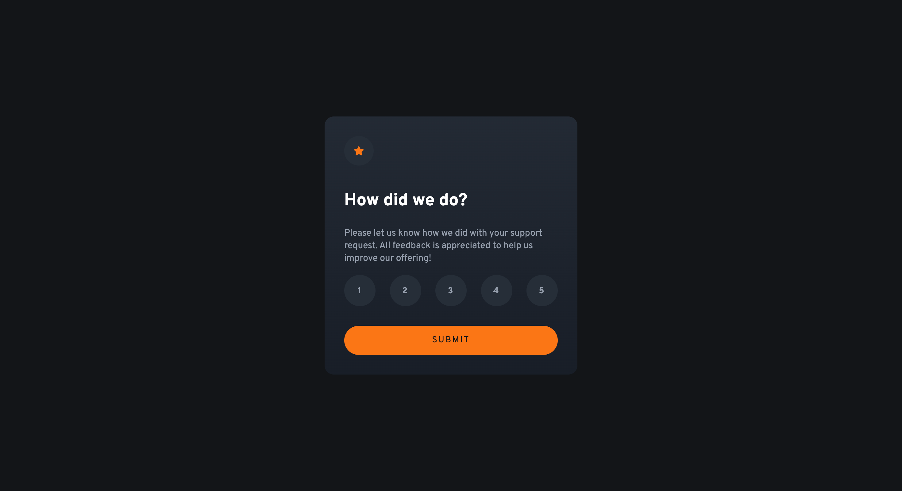

# Frontend Mentor - Interactive rating component - Solution

This is my solution to the [Interactive rating component challenge on Frontend Mentor](https://www.frontendmentor.io/challenges/interactive-rating-component-koxpeBUmI).

## Table of contents

- [Overview](#overview)
  - [The challenge](#the-challenge)
  - [Screenshot](#screenshot)
  - [Links](#links)
- [My process](#my-process)
  - [Built with](#built-with)
  - [Continued development](#continued-development)
  - [AI Collaboration](#ai-collaboration)
- [Author](#author)

## Overview

### The challenge

Users should be able to:

- View the optimal layout for the app depending on their device's screen size
- See hover states for all interactive elements on the page
- Select and submit a number rating
- See the "Thank you" card state after submitting a rating

### Screenshot

### Links

- Solution URL: [Source Code](https://github.com/irfanoezen/interactive-rating-component)
- Live Site URL: [Preview](https://irfanoezen.github.io/interactive-rating-component/)

## My process

### Built with

- Semantic HTML5 markup
- CSS custom properties
- Font faces
- Flexbox
- CSS Grid
- Mobile-first workflow
- Vanilla Javascript

### Continued development

I want to get more confident with Javascript as well as responsive design and behavior.

### AI Collaboration

I use GitHub Copilot with the provided files (agents.md and claude.md), to get guided assistance.

## Author

- Frontend Mentor - [@irfanoezen](https://www.frontendmentor.io/profile/irfanoezen)
